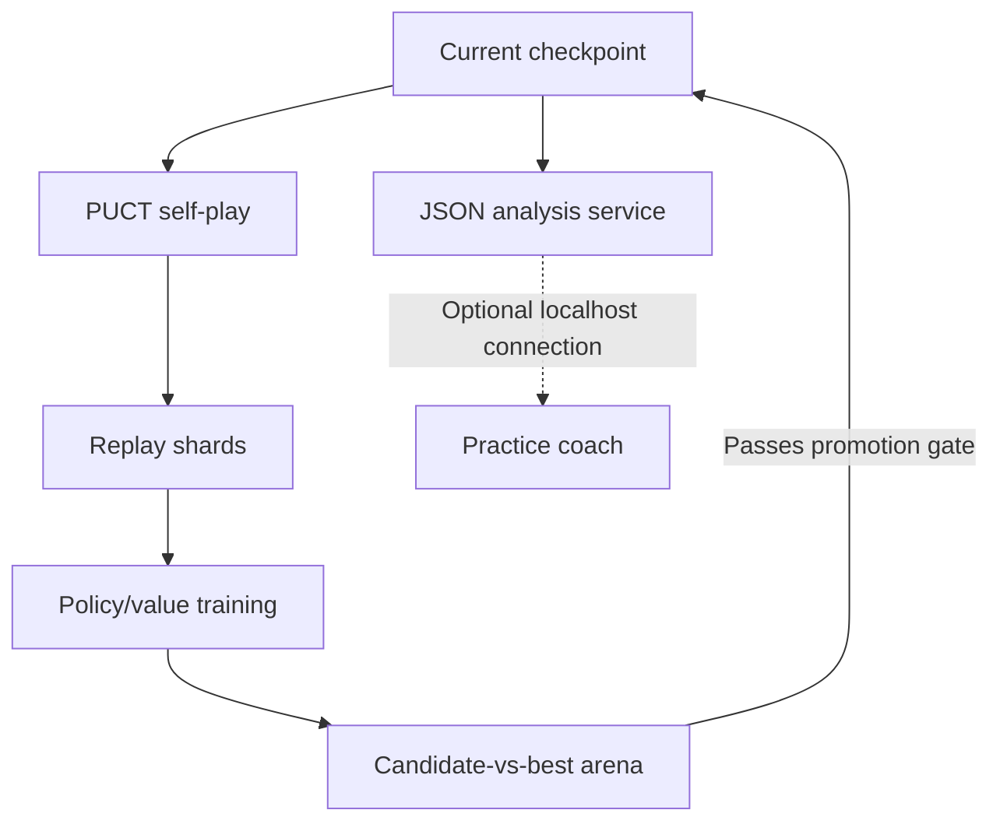

# Wallz / WallZero

A Quoridor practice coach and a self-play learning engine for the full 9×9 game.

| Component                                      | What it does                                                                                                                    | What you need                                               |
| ---------------------------------------------- | ------------------------------------------------------------------------------------------------------------------------------- | ----------------------------------------------------------- |
| [Wallz Practice Coach](wallz-coach.user120.js) | Reads the browser board, highlights a move, explains route impact, and optionally plays it. Includes a classical search engine. | A userscript manager and a Wallz.gg practice game.          |
| [WallZero](src/wallzero/)                      | Learns a policy and value network through self-play, evaluates checkpoints, and serves move analysis.                           | Python 3.11+ and uv. A GPU helps with larger training runs. |

The coach works without Python or a neural checkpoint. WallZero is experimental; the
[recorded evaluations](#strength-gates) do not establish parity with the coach's
classical engine.

[Use the coach](#use-the-browser-coach) · [Run locally](#run-wallzero-locally) ·
[Train](#train-and-resume) · [Protocol](#analysis-protocol) ·
[Development](#development) · [Research notes](#research-notes)

## Use the browser coach

1. Create a new script in your userscript manager, such as Tampermonkey.
2. Replace the template with the full contents of
   [wallz-coach.user120.js](wallz-coach.user120.js), then save and enable it.
3. Open [Wallz.gg](https://wallz.gg/) and start a game against the computer.
4. The Routefinder panel shows a recommendation on your turn. Follow the highlighted
   pawn move or wall placement and compare the route distances.

Use the coach only for vs-computer practice. The current script checks board freshness,
turn ownership, and move legality, but does **not** independently verify the match mode.
Disable the script before entering multiplayer or ranked games.

| Control            | Behavior                                                                                                           |
| ------------------ | ------------------------------------------------------------------------------------------------------------------ |
| Recalculate        | Starts a fresh analysis and retries the local WallZero connection when enabled.                                    |
| Autoplay           | Off on page load. When armed, applies a fresh legal recommendation and checks that the board accepted the input.   |
| WallZero           | Toggles the optional local neural engine. The preference persists in browser storage.                              |
| Export latest loss | Downloads a local JSON diagnostic report after a recorded loss. The browser retains the three most recent reports. |

The built-in engine uses adaptive search with a budget of up to 1.5 seconds. Board hints
account for rotation. Autoplay pauses when the tab is hidden, the board cannot be read,
or automatic input fails.

### Connect the optional neural engine

After [installing WallZero](#run-wallzero-locally), serve the included, frozen round-14
checkpoint:

```bash
uv run wallzero serve \
  --checkpoint artifacts/runs/a100-bootstrap/best-gate-passed.pt \
  --http 8787
```

Leave that process running, then reload the practice page or click Recalculate. The
WallZero button reports the connection state. The server binds to `127.0.0.1` by
default; the coach connects to port `8787`.

If the panel reports an offline engine, check the server:

```bash
curl http://127.0.0.1:8787/health
```

The response should contain `"schema": "wallzero.health.v1"` and `"status": "ok"`.
Failed or timed-out analysis requests fall back to the classical engine with a visible
offline note. Replies must match the request ID and position fingerprint, and the
recommended move must still be legal.

## Run WallZero locally

Install Python 3.11+ and uv, then clone the repository and sync its locked dependencies:

```bash
git clone https://github.com/IsaacZhangg/Wallz.git
cd Wallz
uv sync --locked --group dev
```

Run the smallest complete learning loop on CPU:

```bash
uv run wallzero smoke --output artifacts/runs/smoke --device cpu
```

This generates self-play data, trains a candidate, runs a two-game arena, and writes
checkpoints and metrics. It checks that the stages work together; the resulting model
has no established playing strength.

Inspect a checkpoint or list the CLI commands:

```bash
uv run wallzero inspect-checkpoint --checkpoint artifacts/runs/smoke/best.pt
uv run wallzero --help
```

Commands that accept `--device` default to `auto`, which selects CUDA, then Apple MPS,
then CPU. Use `--device cpu`, `--device mps`, or `--device cuda` to choose explicitly.

## Train and resume

Start with the bootstrap preset:

```bash
uv run wallzero train \
  --preset bootstrap \
  --output artifacts/runs/bootstrap \
  --device auto
```

The CLI presets in [pipeline.py](src/wallzero/pipeline.py) set the following budgets.
Network sizes are residual blocks × channels.

| Preset      | Network  | Self-play games per iteration | Simulations per self-play move | Arena games | Total iterations |
| ----------- | -------- | ----------------------------- | ------------------------------ | ----------- | ---------------- |
| `smoke`     | 2 × 32   | 2                             | 4                              | 2           | 1                |
| `bootstrap` | 6 × 64   | 32                            | 64                             | 16          | 3                |
| `colab`     | 10 × 128 | 128                           | 160                            | 40          | 12               |
| `expert`    | 15 × 192 | 1,024                         | 800                            | 200         | 100              |

The `expert` name describes a compute budget, not a demonstrated skill level. Campaign
scripts can override these presets; their recorded runs are separate from this CLI
quickstart.

Each run keeps its outputs together:

```text
artifacts/runs/bootstrap/
├── best.pt          # Initial model, then the latest arena-promoted model
├── candidates/      # Trained challengers, including rejected candidates
├── replay/          # Compressed self-play shards
├── metrics.jsonl    # Losses, arena results, promotion decisions, and timing
└── run-state.json   # Completed iteration count and checkpoint paths
```

Rerun the same command with the same preset and output directory to resume from the last
completed iteration. `--iterations` sets the total target, not an additional count. For
example, extend a three-iteration run to six:

```bash
uv run wallzero train \
  --preset bootstrap \
  --output artifacts/runs/bootstrap \
  --iterations 6
```

Resume works at iteration boundaries. An interrupted iteration runs again; the CLI does
not restore an in-progress search or optimizer step. Use a new output directory for a
separate experiment.

For a Colab GPU runtime, [scripts/colab_train.py](scripts/colab_train.py) wraps the same
loop and reports accelerator details. The scripts under `scripts/node_*` and the
[systemd templates](scripts/systemd/README.md) support a dedicated training node.
The templates require local account settings, and the scripts retain hardware settings
from the recorded GTX 1080 campaign. Review them before deployment.

The transfer helpers require an SSH destination, supplied as an argument or through
`WALLZERO_NODE`. Their default remote directory is `wallzero/output/wallzero-output`,
relative to the remote account's home directory. Set `WALLZERO_REMOTE_DIR` or pass a
remote-directory argument to override it:

```bash
export WALLZERO_NODE=training-node
bash scripts/pull_node_chunks.sh
bash scripts/push_node_checkpoint.sh artifacts/runs/a100-bootstrap/best-gate-passed.pt
```

Positional arguments take precedence over environment variables. The pull helper
accepts `[node] [remote-dir] [local-dir]`; the push helper accepts
`<checkpoint> [node] [remote-dir]`. The GPU canary stores its reference under the
executing account's `~/wallzero/` directory.

## How the engine learns



WallZero starts from random weights. It uses no human games, opening books, strategy
labels, or scores from the classical coach in its training loop. Training uses game
outcomes, legal-action masks, board symmetries, and exact rule-derived information.

- The rules engine handles pawn jumps, diagonal moves, wall overlap and crossing, and
  the requirement that both players retain a path to goal.
- Position encoding uses 13 planes in the current player's orientation, with left/right
  symmetry augmentation.
- PUCT Monte Carlo Tree Search uses network policy and value predictions, exploration
  noise during self-play, temperature scheduling, and tree reuse.
- An exact pawn-race solver handles positions where both players have spent all their
  walls, with the placed wall layout held fixed. It supplies search values, self-play
  targets, and arena adjudications.
- Batched inference and optional multiprocess actors support larger runs. `leaf_batch=1`
  is the reference search path; larger virtual-loss batches change visit allocation and
  should be recorded with evaluation results.
- Optional KataGo adaptations include randomized playout caps, forced playouts with
  policy target pruning, policy surprise weighting, and a shortest-path distance head.
  The default network uses BatchNorm; fixed-scale normalization, global pooling, and
  dual training/inference heads are available by configuration.

The training-loop decomposition draws on
[AlphaQuoridor](https://github.com/dorakingx/AlphaQuoridor). The
[KataGo adaptation notes](docs/katago-adaptations.md) track implemented options,
experiments, and remaining work.

## Strength gates

Training loss and arena promotion measure different things. The standard CLI promotes a
candidate through paired games with swapped colors and shared random openings. Some
research campaigns deliberately adopt every candidate without a gate, so a file named
`best.pt` alone is not evidence of strength.

Recorded July 2026 results illustrate the gap:

| Checkpoint and opponent         | Budget and sample                                                | Recorded result                                                                                            |
| ------------------------------- | ---------------------------------------------------------------- | ---------------------------------------------------------------------------------------------------------- |
| Round 14 vs uniform-prior MCTS  | Equal 192 simulations, 600 games across three seeds              | 57.5% score; 95% Wilson interval 53.5–61.4%. [Evidence](artifacts/runs/a100-bootstrap/strength-eval.jsonl) |
| Round 24 vs frozen round 14     | Equal 192 simulations, 600 games                                 | 50.0% score; interval 46.0–54.0%. [Evidence](artifacts/runs/a100-bootstrap/strength-eval-r24-30m.jsonl)    |
| Round 31 vs the classical coach | WallZero at 160 simulations, classical adaptive search, 30 games | 0 wins, 30 losses. [Evidence](artifacts/runs/a100-bootstrap/classical-match-r31.jsonl)                     |

Score counts a draw as half a win. The round-14 result supports an advantage over the
uniform-prior control. It does not establish expert play or an advantage over the
classical coach. Independent evaluations live in
[evaluation.py](src/wallzero/evaluation.py); strength claims require a frozen
checkpoint, recorded search settings, independent seeds, and confidence intervals.

The [training history](docs/training-history.md) preserves the campaign record,
including failed hypotheses and the later restart from round 31.

## Analysis protocol

The same request works with `POST /analyze`, the `analyze` CLI command, and the
JSON-lines stdio server. Save this example as `request.json`:

```json
{
  "schema": "wallzero.analyze.v1",
  "id": "position-42",
  "state": {
    "pawns": {
      "p1": { "x": 4, "y": 0 },
      "p2": { "x": 4, "y": 8 }
    },
    "turn": "p1",
    "walls": [],
    "wallsRemaining": { "p1": 10, "p2": 10 },
    "winner": null
  },
  "options": { "simulations": 16, "topMoves": 5 }
}
```

```bash
uv run wallzero analyze \
  --checkpoint artifacts/runs/a100-bootstrap/best-gate-passed.pt \
  --request request.json
```

Coordinates are zero-based. Player 1 aims for row `8`; player 2 aims for row `0`. Placed
walls use objects such as `{ "o": "h", "x": 3, "y": 4 }`, with `h` or `v` orientation
and anchor coordinates from `0` to `7`.

The response schema is `wallzero.analysis.v1`. It includes the request ID, position
fingerprint, selected move, action code, root value, simulation budget, and top moves
with visit counts and probabilities. Root value is from the player-to-move perspective.

Both engines share a fixed 209-action layout:

| Action codes   | Meaning                                       |
| -------------- | --------------------------------------------- |
| `0` to `80`    | Pawn destination, encoded as `y * 9 + x`.     |
| `81` to `144`  | Horizontal wall, encoded as `81 + y * 8 + x`. |
| `145` to `208` | Vertical wall, encoded as `145 + y * 8 + x`.  |

For stdio, run `wallzero serve` through uv with a checkpoint and omit `--http`. Send one
complete JSON object per line. The protocol implementation and HTTP error handling are
in [protocol.py](src/wallzero/protocol.py).

## Development

Python dependencies and development tools use uv. Bun runs the userscript tests; Node.js
is also needed for the Python-to-JavaScript rules parity test, which otherwise skips.

```bash
uv run pytest
bun test wallz-coach.user120.test.js
```

The tests cover rules and legality, board transforms, the pawn-race solver, search,
replay, training resume, network architectures, evaluation, and the browser protocol.
They do not establish compatibility with a changed live Wallz page or prove playing
strength.

Before pushing code changes, update this README and run the relevant checks:

```bash
uv run ruff check --fix src tests scripts
uv run ruff format src tests scripts
uv run ty check
bunx @biomejs/biome check --write wallz-coach.user120.js wallz-coach.user120.test.js
```

## Research notes

Keep raw diagnostic dumps, runtime logs, `.env` credentials, agent worktrees, and
personal service configurations out of Git. The ignore rules cover these local files;
the systemd `.service.example` templates, evaluation records, manifests, and documented
checkpoints remain tracked. `.env.example` is reserved for examples without secrets.
Ignoring a file does not remove copies already committed in Git history.

| Document                                             | Contents                                                                                        |
| ---------------------------------------------------- | ----------------------------------------------------------------------------------------------- |
| [Training history](docs/training-history.md)         | Archived campaign observations, benchmarks, failures, and the July 29 restart.                  |
| [KataGo adaptations](docs/katago-adaptations.md)     | Implemented techniques and measured search experiments.                                         |
| [Training audit](docs/katago-training-audit.md)      | Replay, optimization, architecture, and compute investigations.                                 |
| [Adoption plan](docs/katago-adoption-plan.md)        | The July 29 proposal for architecture and training changes, before the later campaign decision. |
| [Data-volume test](docs/data-volume-test.md)         | Predeclared test, early closure, and the replay-window confound.                                |
| [GTX 1080 incident log](docs/node-1080-wedge-log.md) | CUDA stalls, hardware measurements, and recovery experiments.                                   |
| [Campaign artifacts](artifacts/runs/a100-bootstrap/) | Committed checkpoints, manifests, and evaluation records.                                       |

These are dated research records. Hardware state, deployment paths, and references to a
"current" model describe the recorded run, not a live service status.
